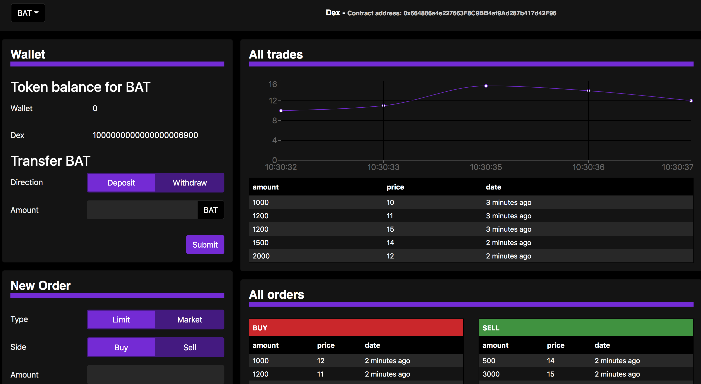
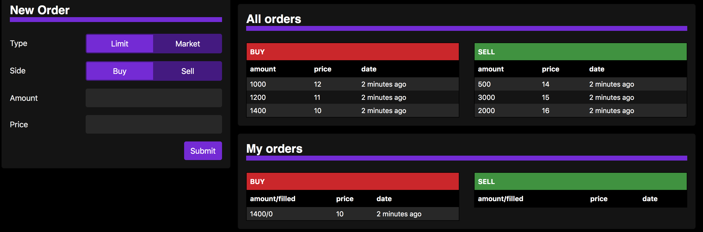

## Local Testing

`npm install`

To view frontend in browser, first run development blockchain

`truffle develop`

`migrate --reset`

then,

`cd client`

`npm start`

### Libraries used:

SafeMath library from OpenZeppelin was used and imported in Dex.sol

### Resources
https://blog.logrocket.com/the-definitive-guide-to-scss/